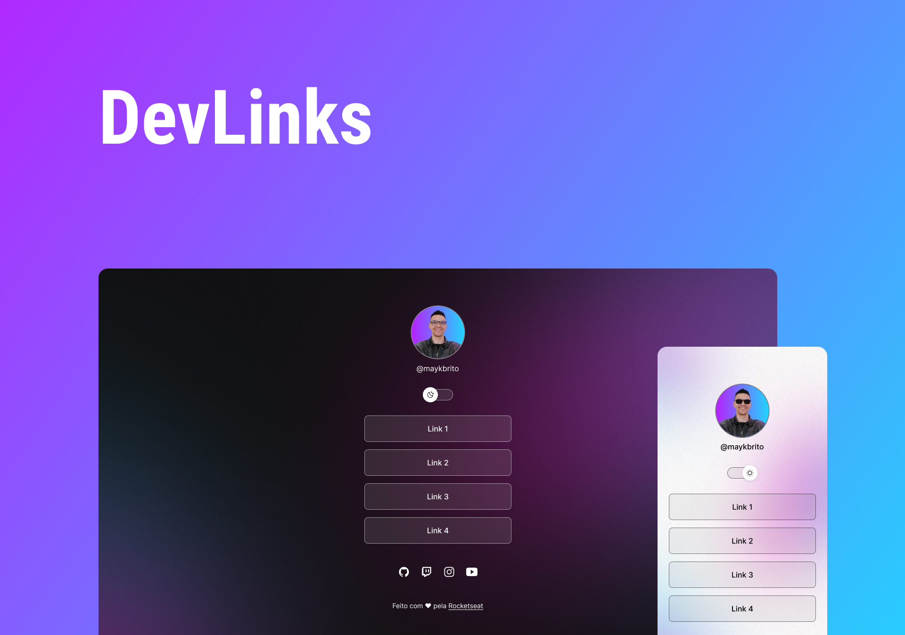

# DevLinks
  
***Desenvolvido no explorer da @Rocketseat!***

> O DevLinks é um agregador de links para usar como cartão de visitas online.

> Status: ***Concluído...*** ✅ 
## Tecnologias 🚀

## Licença 📝

  